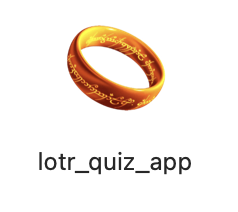
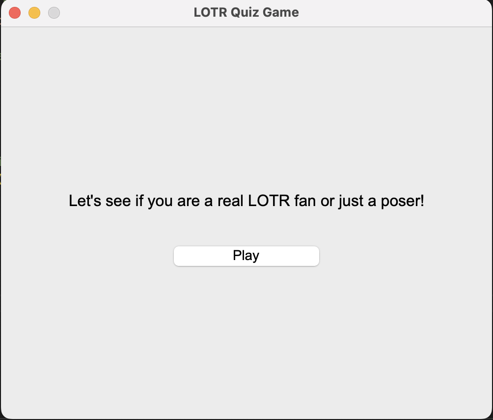
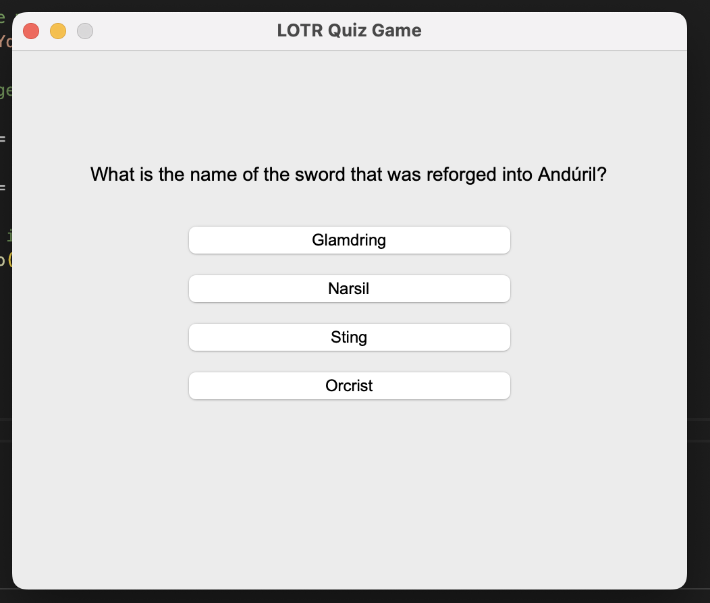
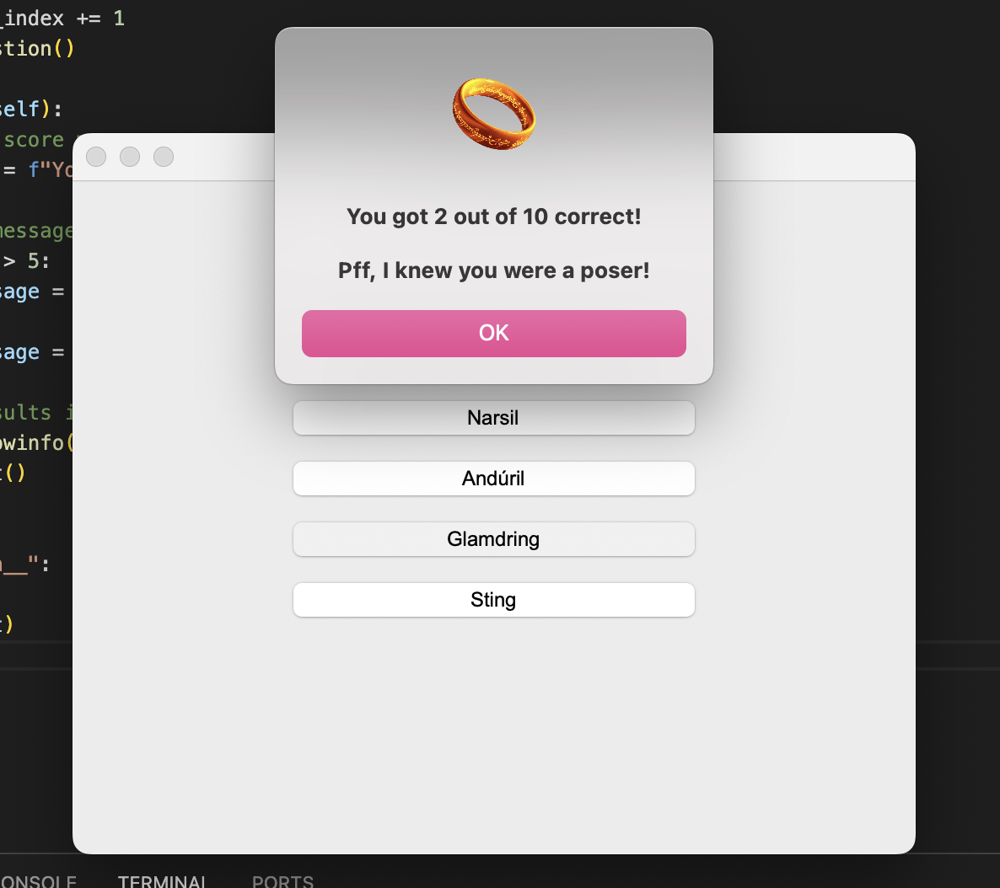

# LOTR Quiz Game 🧙‍♂️

I built this project because I wanted to challenge my friends on their Lord of the Rings knowledge — but I also wanted it to feel like a real game, not just something running in VS Code. Along the way, I learned how to use **Tkinter**, package a Python app as a standalone `.app` on Mac, and improve the UI to make it more fun and interactive.  

---

## Features

- Play a LOTR-themed quiz with multiple choice questions.
- Interactive GUI built with **Tkinter**.
- Score tracking with custom messages based on performance.
- Fully functional Python script (`lotr_quiz_app.py`) that can be run locally.
- Planned: packaging as `.exe` for Windows users.

---

## How to Run

1. Clone this repository:

```bash
git clone https://github.com/unicornmocha/Lotr-Quiz-Game.git

cd Lotr-Quiz-Game

python lotr_quiz_app.py
```

Note: Make sure you have Python 3 installed on your machine and the tkinter package available.

---

## Tech Stack

- Python 3
- Tkinter (GUI)
- Basic object-oriented programming
- Packaging tools for standalone .app (Mac)

---

## Project Status

- ✅ Core game logic complete
- ✅ GUI implemented with Tkinter
- ⚡ Standalone .app working on Mac
- ⚡ .exe packaging in progress
- 🖌 Final UI enhancements in progresss

---

## Screenshots






---

## Learnings

- Creating an interactive GUI with Python and Tkinter.
- Packaging Python scripts into standalone applications.
- Using classes and object-oriented programming to structure code.
- Managing project assets (icons, images) with Python.
- Problem-solving and iterating on design to improve user experience.